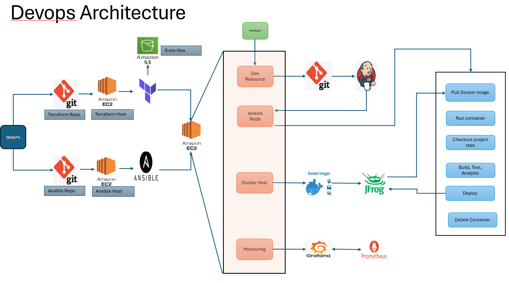

# Polyglot Microservices Calculator

A complete end-to-end DevOps implementation of a Microservices application, demonstrating **Infrastructure as Code (IaC)**, **Configuration Management**, **CI/CD Automation**, and **Observability**.

## 📖 Overview

This project is not just a calculator; it is a reference architecture for deploying polyglot microservices on AWS. It decouples the application logic into two distinct services:
1.  **Auth Microservice:** Written in **Python (Flask)**, handling user authentication.
2.  **Calculation Microservice:** Written in **Java (Spring Boot)**, handling core business logic.

The infrastructure is provisioned immutably, configured dynamically, and deployed via a secure CI/CD pipeline.

---

## 🏗 Architecture & Workflow

The system is designed with a clear separation between **Infrastructure Provisioning** (DevOps Engineer) and **Application Delivery** (Developer).



### 1. Infrastructure Layer (IaC)
* **Terraform:** Provisons the AWS EC2 fleet (Jenkins Node, Docker Host, Monitoring Server).
    * *Best Practice:* State files are securely stored in a remote **Amazon S3** backend with locking enabled to prevent race conditions.
* **Ansible:** Connects to the provisioned EC2 instances to configure the environment (installing Docker, Java, Jenkins Agents, Node Exporters).

### 2. CI/CD Pipeline (Jenkins)
The pipeline is triggered via Git webhooks and orchestrates the following lifecycle:
1.  **Checkout:** Pulls the latest code for `calc-microservice` or `auth-microservice`.
2.  **Build & Test:** Compiles Java/Python code and runs unit tests.
3.  **Static Analysis:** Scans code for vulnerabilities.
4.  **Artifact Management:** Docker images are built and pushed to **JFrog Artifactory** (simulated/implemented) as a single source of truth.
5.  **Deploy:** The pipeline pulls the approved image from JFrog and runs the container on the Docker Host.
6.  **Cleanup:** Old containers are gracefully terminated ("Delete Container" phase) to ensure resource optimization.

### 3. Observability
* **Prometheus:** Scrapes metrics from the Node Exporters running on the application servers.
* **Grafana:** Visualizes system health, CPU usage, and container status in real-time dashboards.

---

## 🛠 Tech Stack

| Domain | Tools Used |
| :--- | :--- |
| **Languages** | Python (Flask), Java (Spring Boot) |
| **Infrastructure** | AWS EC2, Terraform (Remote State on S3) |
| **Config Mgmt** | Ansible |
| **CI/CD** | Jenkins, Git |
| **Containerization** | Docker, JFrog Artifactory (Registry) |
| **Monitoring** | Prometheus, Grafana |

---
## 📂 Project Structure

```text
01-basic-calculator/
├── infra/
│   ├── terraform/       # Provisioning EC2, VPCs, & S3 State buckets
│   ├── ansible/         # Playbooks for server configuration
│   └── scripts/         # Automation scripts for inventory updates
├── auth-microservice/   # Python Flask Login Service
├── calc-microservice/   # Java Spring Boot Calculator Service
└── architecture-diagram.png